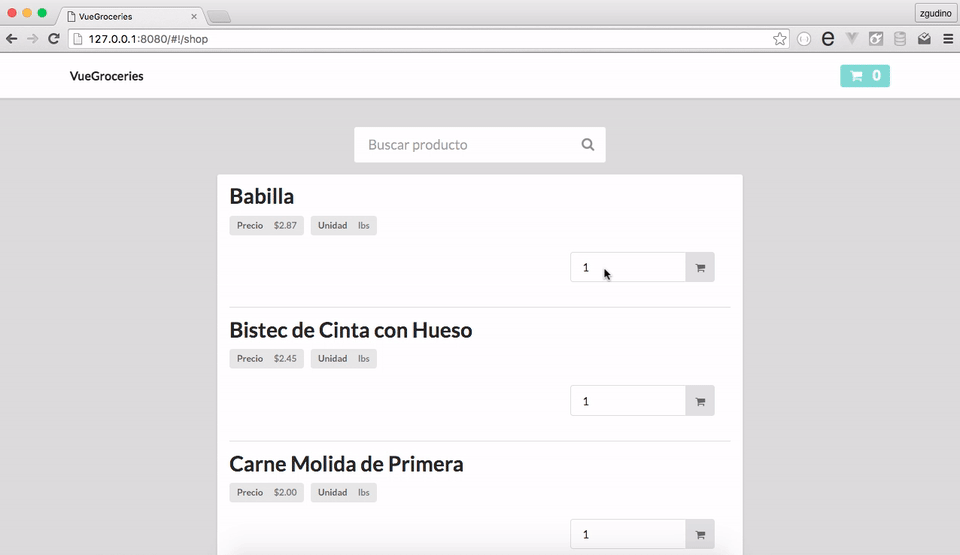

# vue-groceries

> Simple carrito de super mercado desarrollado con Vuejs





Presentado en el evento [__FLISOL 2016__](https://www.facebook.com/media/set/?set=a.10154868403359179.1073741839.394122564178&type=3) Panama, __*vue-groceries*__ es un carrito de super mercado con los productos oficial de la ACODECO.

Mi meta es mostar lo sencillo que es desarrollar un carrito de super mercado utilizando mas nada que [Vue](https://vuejs.org) y [VueRouter](http://router.vuejs.org/en/index.html).

#### Vuejs

Vuejs es una libreria para construir interfaces interactivas web. La meta es proporcionar los beneficios de __reactive data binding__ y __composable view components__ los mas simple posible.

Vuejs no es un framework _per se_ --su uso es a nivel de la capa vista. SPA es posible utilizando herramientas y otras librerias.

## Uso

``` bash
# Instalar dependencias
npm install

# Disponible Hot Reload al 127.0.0.1:8080
npm run dev
```

## Licencia

MIT © 2016
